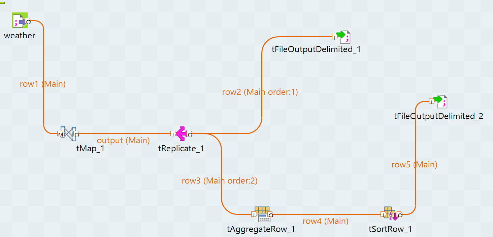

# Weather Data ETL Pipeline

End-to-end ETL pipeline that ingests weather forecast data from a JSON API, converts it to structured CSV format using Python, and performs transformation, replication, aggregation, and sorting using Talend to produce clean analytical datasets.

## Overview
This project implements an end-to-end ETL pipeline for processing weather forecast data.

The pipeline extracts weather data from a JSON API, converts it into a structured CSV format using Python, and processes it through a Talend workflow that performs transformation, replication, aggregation, and sorting to produce analytical datasets.

## Architecture

Weather API (JSON)  
↓  
Python preprocessing (`converter.py`)  
↓  
Talend ETL Pipeline  
- tMap (data transformation)  
- tReplicate (data branching)  
- tAggregateRow (aggregation)  
- tSortRow (sorting)  
↓  
Output datasets

## Technologies
- Python  
- Talend Open Studio  
- CSV  
- ETL pipeline design  

## Repository Structure

weather-data-etl  
│  
├ data/          # Raw and processed datasets  
├ scripts/       # Python preprocessing script  
├ talend/        # Talend ETL workflow  
├ screenshots/   # Pipeline diagram  
└ README.md  

## Output Files
- `weatherOut.csv` – cleaned weather dataset  
- `weatherSummary.csv` – aggregated weather statistics  

## Pipeline Diagram

